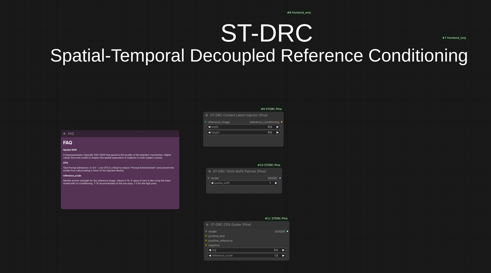

ComfyUI implementation of <b>Spatial-Temporal Decoupled Reference Conditioning for
Identity-Preserving Text-to-Video Generation</b> 

Based on this paper: https://arxiv.org/pdf/2606.02441

This implemenation concentrates more on I2V.  I'm looking into what can be done with T2V.

Optional: My face_preservation lora here [Face Preservation Lora on Huggingface](https://huggingface.co/PineAmbassador/face_preservation/resolve/main/face_preservation_ltx2.3_musubi_v1.1.comfy.safetensors?download=true)
